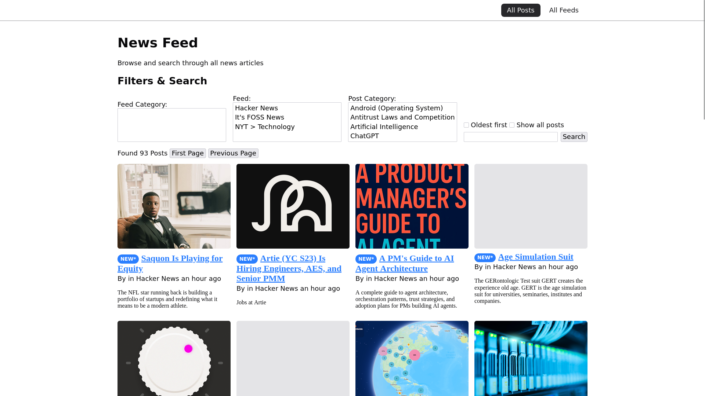
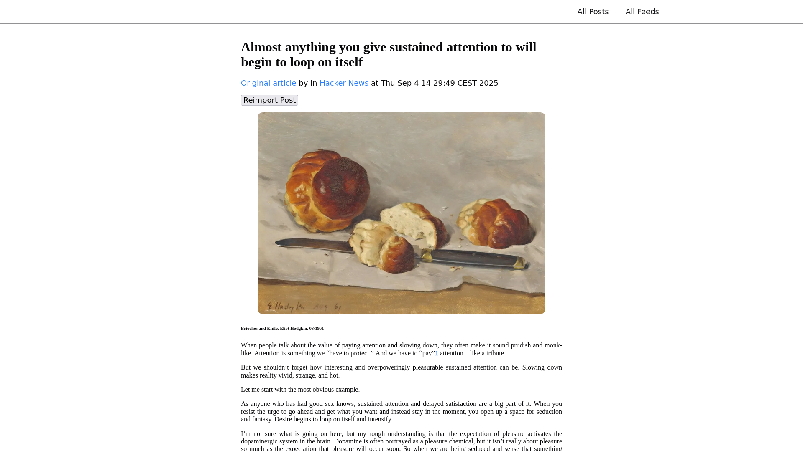
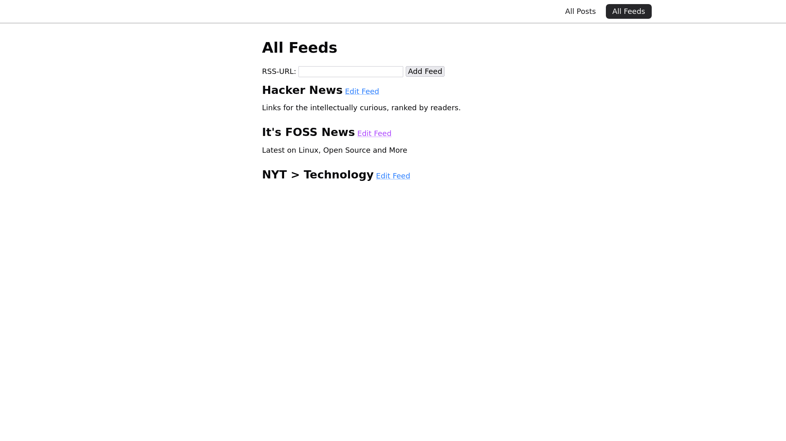

# RSS Reader

A lightweight, self-hosted RSS feed reader built with Go and Fiber web framework. Features a clean web interface for managing feeds and reading articles with full-text search capabilities.

## Features

- **Feed Management**: Add, remove, and organize RSS/Atom feeds
- **Article Reading**: Clean, readable interface for consuming content
- **Full-Text Search**: Search through article titles, content, and authors using SQLite FTS5
- **Article Parsing**: Enhanced readability with content extraction and sanitization
- **Responsive Design**: Works on desktop and mobile devices
- **Database**: SQLite storage with automatic migrations
- **Dark/Light Mode**: Theme switching support [Theme toggle icons included]

## Screenshots





## Quick Start

### Prerequisites

- Go 1.21 or higher
- SQLite3

### Installation

1. Clone the repository:
```bash
git clone https://github.com/zuramm/rss-reader.git
cd rss-reader
```

2. Install dependencies:
```bash
go mod download
```

3. Run the application:
```bash
go run .
```

4. Open your browser and navigate to `http://localhost:3000`

### Using Make

Alternatively, use the provided Makefile:
```bash
make
```

## Configuration

The application uses environment variables for configuration:

- `PORT`: Server port (default: 3000)
- `DB_PATH`: SQLite database file path (default: ./feeds.db)
- `VIEWS_PATH`: HTML templates directory (default: ./views)

Example:
```bash
export PORT=8080
export DB_PATH=/var/lib/rss-reader/feeds.db
go run .
```

## Database Schema

The application automatically creates and migrates a SQLite database with the following tables:

- **Feed**: RSS feed information and metadata
- **Post**: Individual articles with content and read status
- **FeedCategory**: Feed categorization
- **PostCategory**: Article categorization
- **PostIdx**: Full-text search index using FTS5

## Development

### Dependencies

Key dependencies include:
- **Fiber v2**: Fast HTTP web framework
- **gofeed**: RSS/Atom feed parsing
- **go-readability**: Article content extraction
- **SQLite3**: Database driver
- **bluemonday**: HTML sanitization

### Project Structure

```
├── main.go              # Application entry point and database setup
├── feed.go              # Feed management logic
├── feed-list.go         # Feed listing endpoints
├── post.go              # Post/article data structures
├── post-list.go         # Post listing endpoints
├── fetch-posts.go       # RSS feed fetching and parsing
├── parse-article.go     # Article content extraction
├── public/              # Static CSS files
├── views/               # HTML templates
│   ├── layout/          # Base layouts
│   └── icons/           # SVG icons
└── feeds.db            # SQLite database (created automatically)
```

## Planned Features

See [todos.md](todos.md) for the complete roadmap including:

- HTMX integration for smoother UX
- Progressive Web App support
- OPML import/export
- Localization (English/German)
- Image caching and optimization
- Combined article/list view

## Contributing

1. Fork the repository
2. Create a feature branch
3. Make your changes
4. Test your changes
5. Submit a pull request

## License

This project is licensed under the MIT License - see the [LICENSE](LICENSE.md) file for details.

## Support

For issues and feature requests, please use the GitHub issue tracker.

